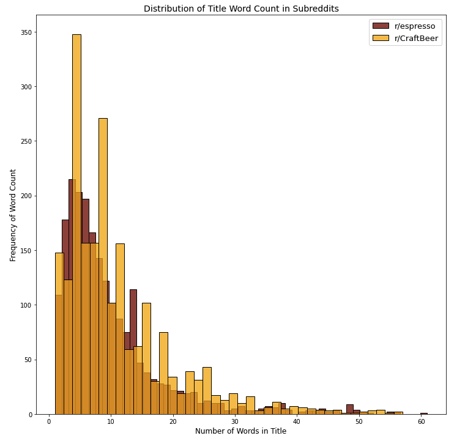
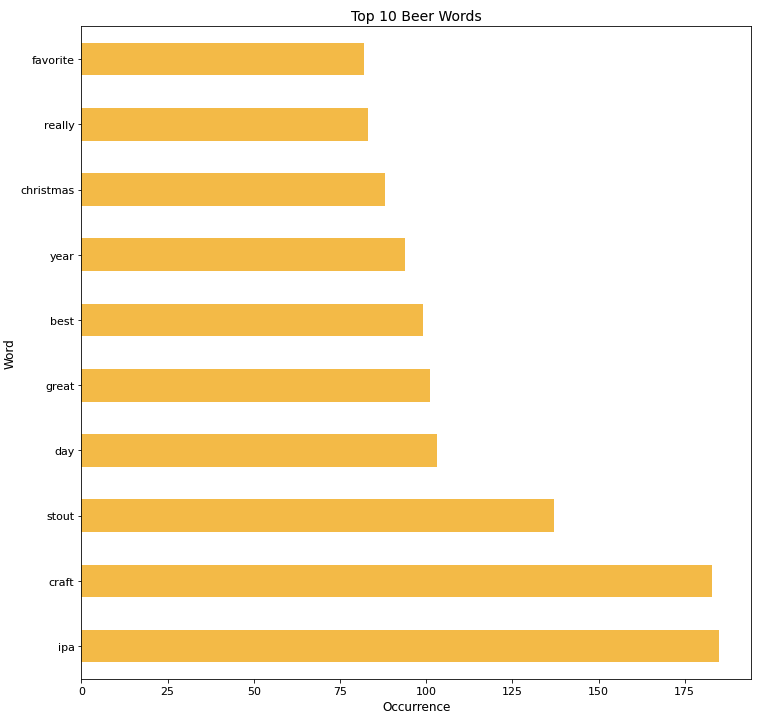
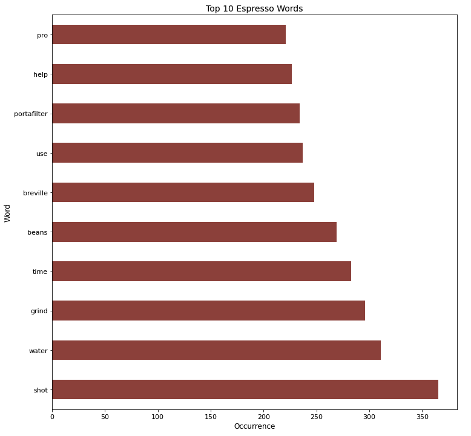
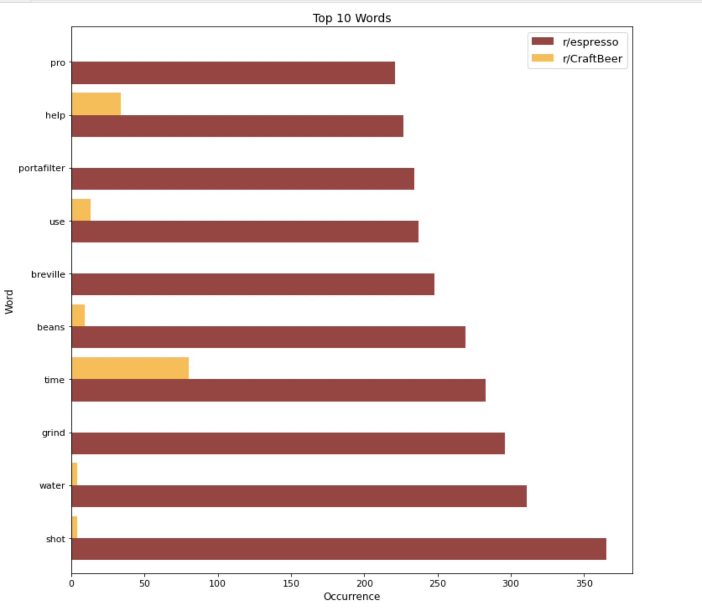
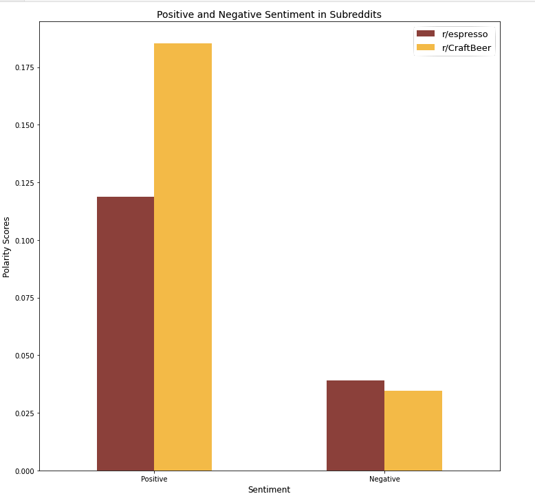
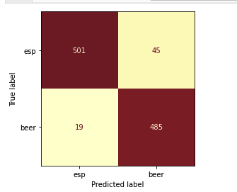

# Web APIs & NLP

#### Project Status: [Completed]

# Problem Statement
Through the application of natural language processing, a model was developed that can extract valuable insight from language analysis of user posts on reddit. 

These insights can be used to identify marketing opportunities for new and existing products as well as guage interest and bolster development of new cross-category products.

---
## Table of Contents:

 ##### 1. Data Workflow

 ##### 2. Insights 
 
 ##### 3. Conclusion

 ##### 4. Data Dictionary

 ##### 5. Notebooks

 ##### 6. Datasets

---
### 1. Data Workflow 

 - Web scrape using [Pushshift's](https://github.com/pushshift/api) API.

 - Data cleaning and preprocessing

 - Modeling

 - Visualization

 - Identify next steps

#### Web Scrape
Using Pushift, posts were scraped from  [`/r/espresso`](https://www.reddit.com/r/espresso)
[`/r/CraftBeer`](https://www.reddit.com/r/CraftBeer) subreddits then merged into a [dataset](data/author_scrape.csv) which was used for analysis.

Work can be seen here: [webscrape from reddit](01_scrape.ipynb)
#### Data Cleaning and Preprocessing
The scraped dataset was cleaned by:

 - Identifying null values in selftext within the subreddit and 
 - Converting null values to empty strings

The cleaned data was further processed by engineering features to aid in analysis and modeling

 - The subreddit topics were mapped such that espresso = 0 and CraftBeer = 1

 - Text from the subreddits was grouped into three categories and columns were created to look for potential trends
 
      - title text only
      - title text and selftext
      - title text, selftext, and author
 
 - Sentiment analysis was done on all levels of text with SentimentIntensityAnalyzer
 
 - Columns were created for each sentiment:
      - negative
      - positive
      - neutral
      - composite
  
 - Columns were created for word count and character count for each level of text
 
     A cleaned and engineered [dataset](data/cleaned_engineered.csv) was created
 
 - Words were counted using CountVectorizer to identify frequent words used among the subreddits
 - A custom list of stop words was created to eliminate both frequent words that would NOT be helpful in predicting espresso over CraftBeer (such as new, good, www, http) as well as clear identifiers (such as espresso, beer, coffee) 
 
    A countvectorized [dataset](data/cvec.csv) was created 

Work can be seen here: [data cleaning and feature engineering](02_clean_fe.ipynb)

#### Modeling
Multiple models were trained to uncover a combination of features and methods that would deliver the highest accuracy on the predictions. 

The baseline model is 0.5001, meaning that an untrained model would be correct 50.01% of the time if predicting espresso over CraftBeer

 ##### CountVectorizer + LogisticRegression in Pipeline
 - All three levels of text were attempted in this model, resulting in a top accuracy score of 0.93 (on the title and selftext category)
 
Work can be seen here: [first model](03_pipe.ipynb)

 ##### TfidfVectorizer + DecisionTreeClassifier in Pipeline
 - The most successful title and selftext category was used to train this mostly unsuccessful model. The resulting accuracy score was 0.73, however, this model was surpirisingly accurate predicting true negatives (i.e. correctly predicting CraftBeer) at a rate of 0.98.
    
    
    
Work can be seen here: [TfidfVec/DecisionTree](04_tfidf_dtc.ipynb)

 ##### Other Model Trials
 - RandomForest 0.87 accuracy - can be seen here: [RandomForest](05_randomforest.ipynb)
 - FeatureUnion 0.91 accuracy - can be seen here: [FeatureUnion](06_feature_union.ipynb)
 
 ##### BEST MODEL: TfidfVectorizer + LogisticRegression in Pipeline
 - The most successful model was created with TfidfVectorizer and LogisticRegressor in a Pipeline. 
The resulting accuracy score was 0.94

Work can be seen here: [best model TfidfVec/LogReg](07_best_tfidf_lr.ipynb)

A predictions [dataset](data/best_preds.csv) was created

#### Visualizations

Work can be seen here: [more eda for visualizations](08_viz.ipynb) 

### 2. Insights

 - The most successful model can predict with 94% accuracy the correct category of a subreddit from the text within.
 - The distribution of wordcount shows that users post with roughly the same frequency and title length (by wordcount)in both subreddits, but posts in the CraftBeer subreddit of 6 and 8 words happen nearly twice as mush as those in espresso.
 - When comparing the top ten most frequently used words in each subreddit, there are none in common (with certain obvious or commonplace words removed). 
 - The overall top ten words between both subreddits contain 6 words in common: (water, shot, beans, use, help, time) but the words were much more heavily used in the espresso subreddit. 
 - Sentiment scores were derived from the text using a sentiment intensity analyzer. The posts in the CraftBeer subreddit were much more positive than those in the espresso subreddit. While both subreddits were much less negative than positive, the CraftBeer subreddit again showed it's positive tone by scoring lower on the negative sentiment as well.

### 3. Conclusion
In conclusion, a model has been built to identify wth 94% accuracy the origination of a subreddit by analyzing the text. Though there are many differences on reddit between the activity of users in the CraftBeer and espresso categories, the exisitence of many key words and at least 6% mis-classification rate exhibits an oportunity for cross-over customers. Perhaps there is space in the market to develop more coffee-flavored beer, or beer-flavored coffee. Perhaps also this model can be generalized to other data to determine interest across other beverages or food.

Recommendations include but are not limited to: 
    - applying this model to text in other social media to look for new markets for existing products 
    - investigating the mis-categorizations within the model for insight into interest in new cross-over products.

### 4. All notebooks:
[webscrape from reddit](notebooks/01_scrape.ipynb)

[data cleaning and feature engineering](notebooks/02_clean_fe.ipynb)

[first model training with different levels of text](notebooks/03_pipe.ipynb)

[TfidfVec/DecisionTree](notebooks/04_tfidf_dtc.ipynb)

[RandomForest](notebooks/05_randomforest.ipynb)

[FeatureUnion](notebooks/06_feature_union.ipynb)

[best model TfidfVec/LogReg](notebooks/07_best_tfidf_lr.ipynb)

[more eda for visualizations](notebooks/08_viz.ipynb) 

### 5. All datasets:
[author_scrape](data/author_scrape.csv), [cleaned_engineered](data/cleaned_engineered.csv), [cvec](data/cvec.csv)

### 6. Data Dictionary:
[data dictionary](data_dictionary.md)

### 7. Images:
[Distribution of wordcount in title by subreddit](images/dist_title_word_count.png), [Top ten words in r/CraftBeer](images/top_ten_beer_words.png), [Top ten words in r/espresso](images/top_ten_espresso_words.png), [Top ten words in entire dataset](images/top_ten_words.png), [Sentiment scores by subreddit](images/sentiment.png), [Confusion Matrix of most successful model](images/confusion_matrix.png)
